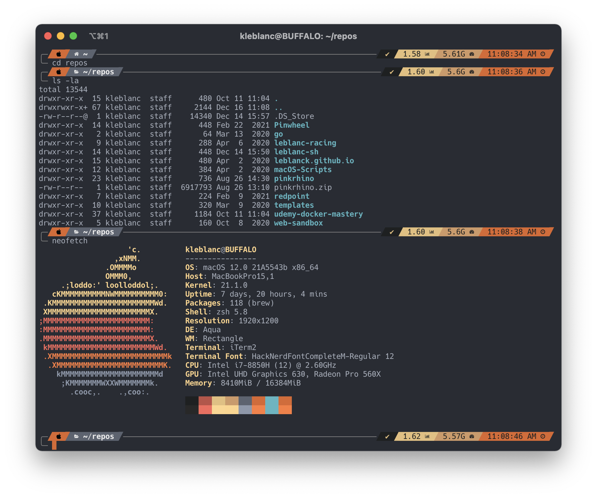
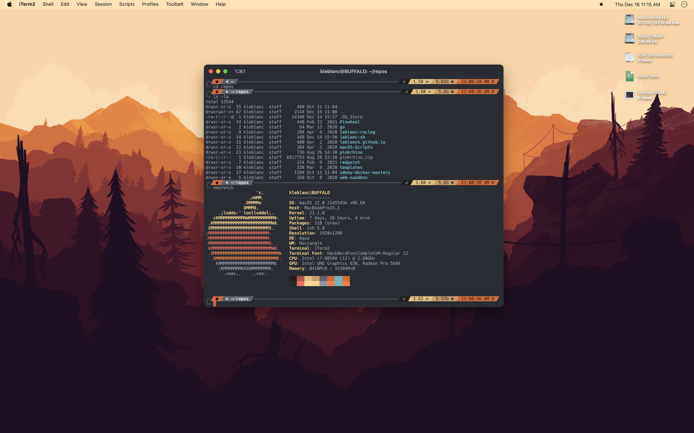

<h1 align="center">
  Firewatch Theme for iTerm2
</h1>

  A minimal, dark theme based on the [Firewatch](http://www.firewatchgame.com) game wallpaper color scheme

## Installation

1. Clone this repo
1. In iTerm2 open `Preferences > Profiles`
1. Under the `Colors` tab find `Color Presets > Import`
1. Import the `firewatch.itermcolors` file

## Additional Info

Wallpaper is available [here](https://blog.camposanto.com/post/138965082204/new-firewatch-wallpaper-official-wallpapers-of).

I'm currently using the [Powerlevel10k](https://github.com/romkatv/powerlevel10k) cli theme for [Oh-My-Zsh](https://github.com/ohmyzsh/ohmyzsh)

If you enjoy this theme, feel free to [buy me a coffee!](https://www.buymeacoffee.com/kyleblanc)

Inspired by the [Firewatch Atom Theme](https://github.com/SebastianSzturo/firewatch-syntax)
